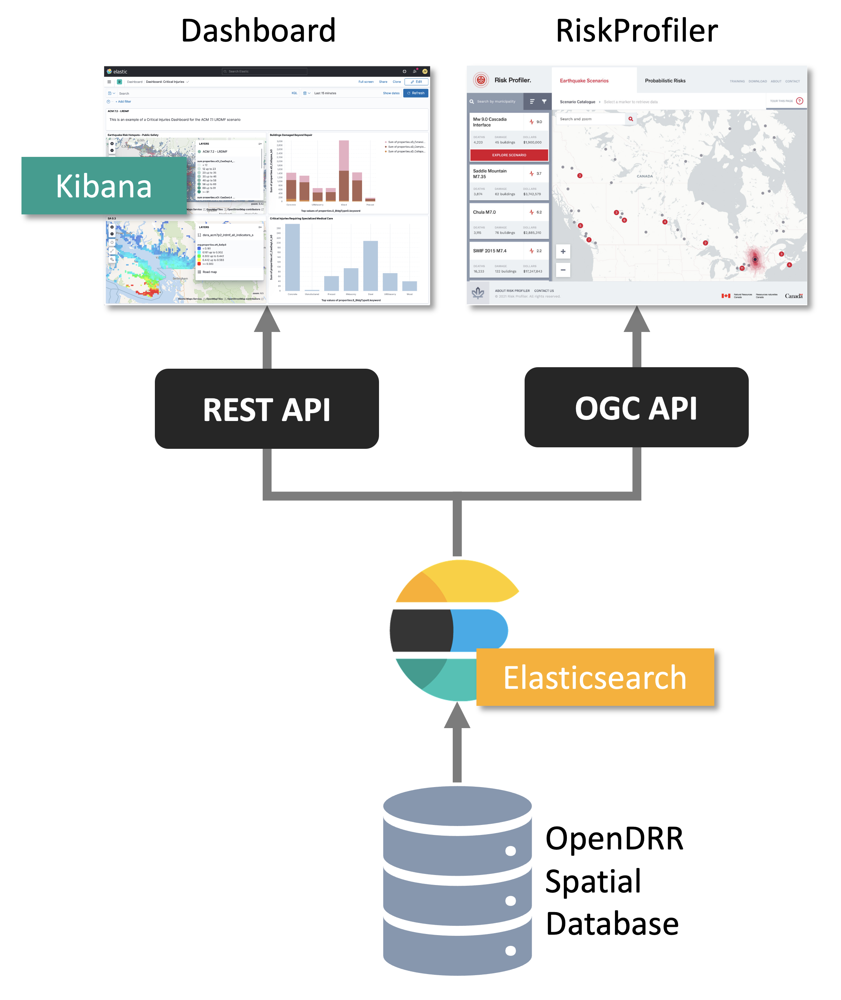

== Architecture

Brief description of achitecture with goals/principles.

Source data for this project includes the National Human Settlement Layers (physical exposure and social vulnerability), the National Seismic Risk model for Canada (CanadaSRM2, probabilistic), Canada’s National Earthquake Scenario Catalogue (deterministic), and boundary geometries are stored in the Open Disaster Risk Reduction Platform (OpenDRR) organisation on GitHub. 

[#image-architecture]
.OpenDRR Architecture Overview

=== Data Processing Pipeline

The OpenDRR platform data processing pipeline is responsible for extracting, transforming and loading (ETL) data. It consists of several open source technologies, namely PostgreSQL with PostGIS extension, Python, ElasticSearch/Kibana, and PyGeoAPI. Each of the applications is containerized using separate Docker containers orchestrated with Docker-Compose.

[#image-etl]
.OpenDRR Data Processing Pipeline

The stack of technologies can be configured to run on a local machine with PostgreSQL and ElasticSearch environments running locally or can be configured to communicate with cloud deployments of these services. For example, the stack can be configured to communicate simultaneously with a PostgreSQL database on Amazon Web Services (AWS) Relational Database Service (RDS) and a Containerized ElasticSearch environment on an AWS Elastic Container Service (ECS). A common use case is to run the ETL process on a local desktop or AWS Elastic Compute Cloud (EC2) with a local containerized PostgreSQL environment and a cloud deployed ElasticSearch environment which can support a public or private application programming interface (API).

The ETL process currently relies on a main shell script titled 'add_data.sh' which downloads the required source data files including comma separated value (csv), and GeoPackages (gpkg) into the local filesystem and performs necessary transformations to load the data into a PostgreSQL database. The script is written to be flexible enough to load any number of conformant deterministic earthquake scenarios and national seismic risk model data? and allows some flexibility in the contents of the input data as long as a minimal number of required fields are present. Once the required source data has been loaded into the database, a number of Structured Query Language (SQL) scripts help transform the data into a framework of meaningful earthquake risk indicators which in turn gets pushed to ES/Kibana ??? . 

Discuss the postgresql database? Briefly?  Schemas?
The PostgreSQL database is created and has PostGIS extension enabled to allow for spatial data queries.   The source datas are loaded into their respected schema names and the results are generated into their respected schemas with results_ prefix.????

Results are calculated and/or aggregated at different spatial scales dependent on the data.  For National Human Settlement Layers the results are in settled areas.  The probabilistic and deterministic data are calculated at the building level and aggregated up to the settled area and census subdivision levels.

These results are aggregated at several different spatial scales, building, sauid, and csd level. The building level is the finest spatial resolution and aggregates all buildings of simmilar construction type for a given neighborhood. The Sauid level of aggregation groups all building types across the whole neighbourhood polygon. The Census Sub-divison (CSD) aggregation is a coarse aggregation of all assets within a given CSD as defined by Statistics Canada. 

=== Data Dissemination

==== API Stack

[#image-apis]
.OpenDRR API Stack

==== Application Stack

[#image-apps]
.OpenDRR Application Stack

