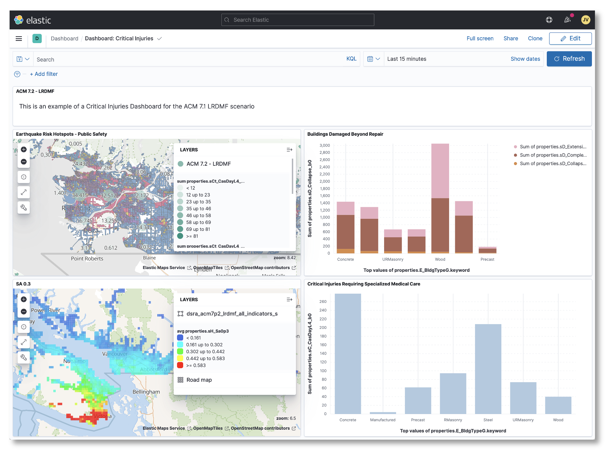
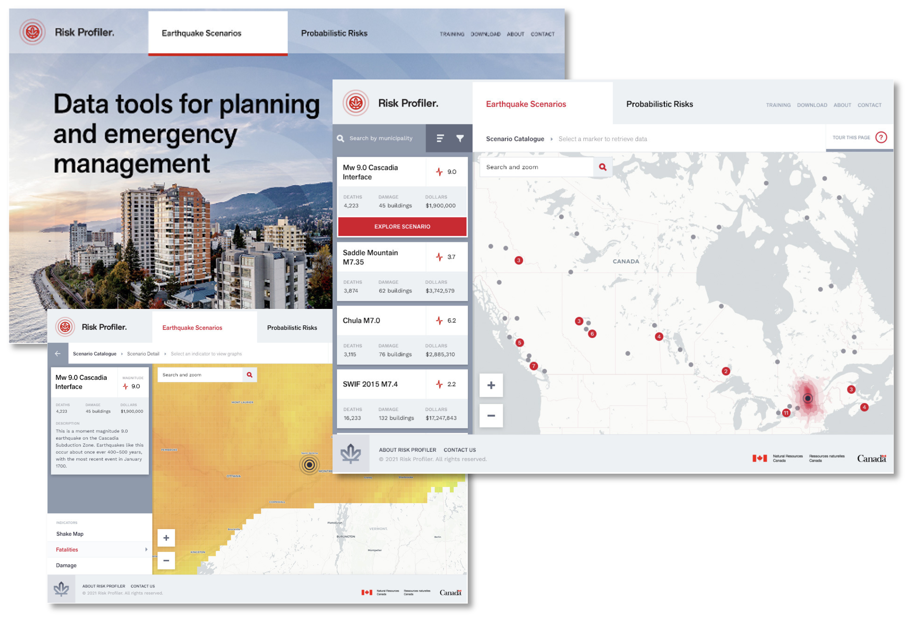

:imagesdir: img

== Overview

[.text-justify]

GitHub was chosen as the platform to support the development of the science outputs and related software, documentation, and tools. While well known in the software development community it is lesser known in the science community. However, the core concepts behind GitHub (e.g.: versioning, repositories, etc.) were more or less understood by key 
contributers. 

Where possible, runnable code is provided to ensure transparency in the science. For example, an interested party could make a copy of a repository and replicate a particular output (e.g.: dataset) or even the entirety of the OpenDRR infrastucture. The platform makes heavy use of containerization and infrastructure as code technologies for rapid deployment on personal computing devices or on the cloud.

[.text-justify]
Built in features of GitHub such as continuous integration and deployment, community building, websites, and secure workspaces were seen as ways toward achieving an open and collaborative approach to science, one that seeks to build concensus and drive engagement throughout it's lifecycle.

[#image-github]
.OpenDRR GitHub
image::opendrr-GitHub-en.png[OpenDRR GitHub]

[.text-justify]
Due to the diversity of use cases and user profiles for the information products (e.g.: maps, visualizations) it was clear that a single solution would not be sufficient. It was determined that a purpose built web application in addition to a customizable dashboard environment would likely meet the needs of all users.

The dashboard environment is provided by Kibanafootnote:[https://dashboard.riskprofiler.ca] which connects to an Elasticsearch document store. This environment is highly customizable and allows individuals and organizations to create public or private spaces where they can query and vizualize all available data in an intuitive way.

[#image-kibana]
.OpenDRR Kibana

The purpose built application, called RiskProfilerfootnote:[https://riskprofiler.ca], is a custom web application that connects to a variety of services including the Elasticsearch document store. Built to be highly scalable and user friendly, it seeks to communicate the key messages relating to natural hazard risk. It provides for some basic filtering and visualization in an area of interest, such as a community or region.

[#image-riskprofiler]
.OpenDRR RiskProfiler

In it's initial release, RiskProfiler will focus primarily on earthquake risk but the intention is to include additional natural hazard risk assessemnts including flood, wildfire, landslides and tsunami.
